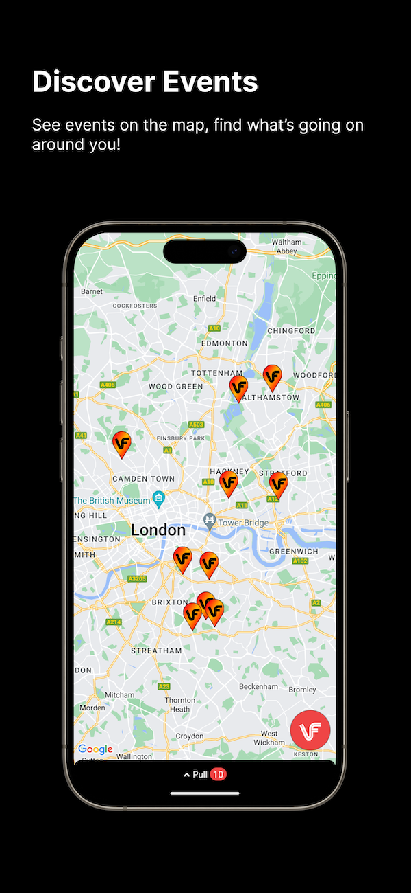
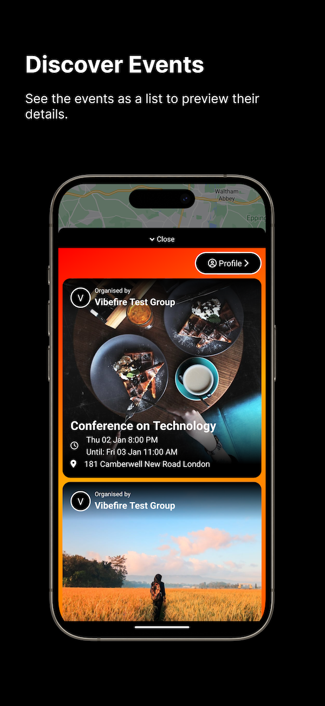
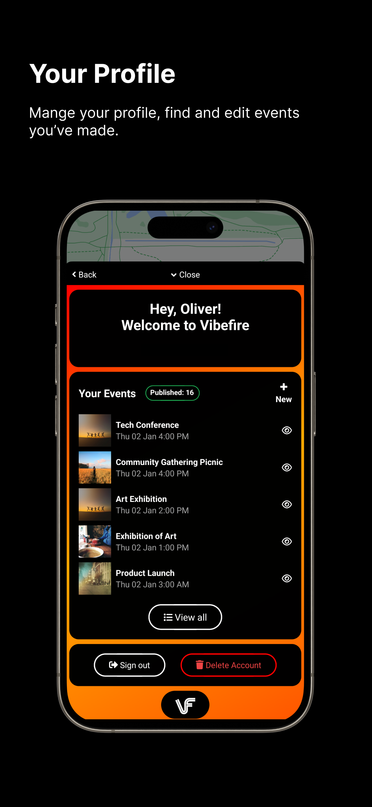
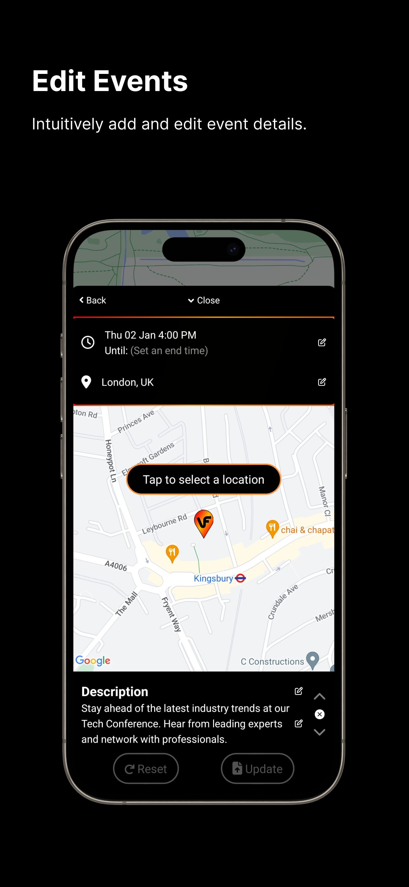
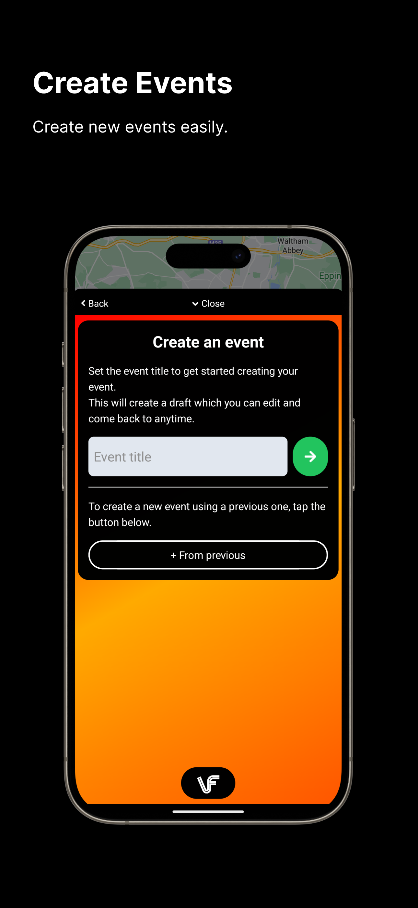
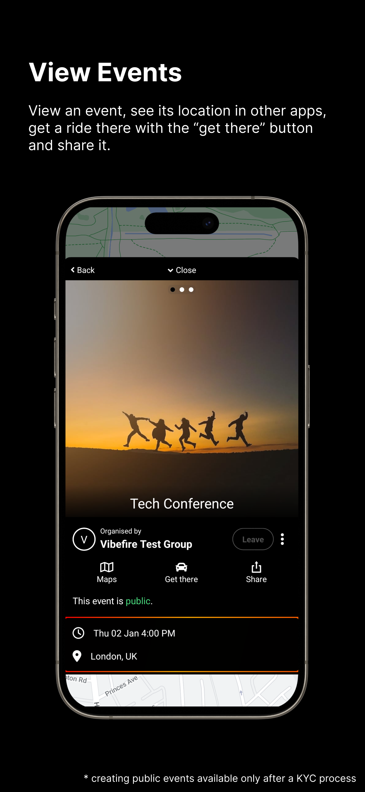

# Vibefire

**Vibefire** is a mobile app that helps people discover and share local events. You can use it to see what’s happening nearby, create your own events, and invite friends to join in.

---

## 🛠 Tech Stack

- **App** – Built with **React Native**, **Tailwind (via NativeWind)**, **tRPC**, **React Query** and **Expo**, making it easy to deploy on both iOS and Android.
- **API** – Runs on **Cloudflare Workers** for fast, globally distributed serverless (edge) functions.
- **Database** – Originally used **FaunaDB**, a NoSQL database with a powerful query language and real-time support. After Fauna shut down, I planned to migrate to **Convex**, but didn't complete the transition in time.

---

## 🚀 Why I Built It

While travelling, I often found it difficult to find what was happening in an area, unless it was an obvious tourist attraction, a well-known ticketed event or a scheduled group meetup. I wanted a way to see what was popular with locals, discover hidden gems and find spontaneous events.

So, I built Vibefire, an event heatmap that shows you what was popular in an area.

I wanted the app to be:
 - Globally scalable
 - Free to use, unless someone wanted to promote their event

To achieve that, I chose lightweight serverless tools that could scale easily and run at a low cost.

---

## 📁 Project Structure

The repo is organised into three main folders:

- **apps/** contains client/user-facing applications and tools.
- **packages/** contains shared code, API, business logic, and integrations.
- **services/** contains backend services and APIs.

```plaintext
apps/
  admin-tools/               # Tools for managing and generating events
  app.vibefire.native/       # The React Native mobile app
  vibefire.app/              # Next.js web app (landing pages, auth)
  vifr.io/                   # Redirect domain for mobile deep links

packages/
  api/                       # API layer using tRPC + Cloudflare Workers
  models/                    # Shared TypeScript models and types
  managers/                  # Business/data logic
  services/                  # Third-party integrations (e.g., Google Maps)
  shared-state/              # Jotai-based state management
  utils/                     # Common utility functions

services/
  api.vibefire.app/          # Core backend for the mobile app
  handle.vibefire.app/       # Webhook handler service
  vibefire-notifications-service/  # Push notifications (iOS & Android)
```

---

## 🧠 Final Thoughts

I’m publishing this project to showcase my full-stack development skills—from building a cross-platform mobile app to deploying serverless infrastructure and handling real-world data.

Vibefire taught me a lot about modern app architecture, mobile UX, and global-first development. Feel free to explore the code, and reach out if you’d like to chat or collaborate.

---

## 📸 Screenshots

Here’s what the app looks like:

| | | |
|:-------------------------:|:-------------------------:|:-------------------------:|
| |   |  |
|   |  ||
